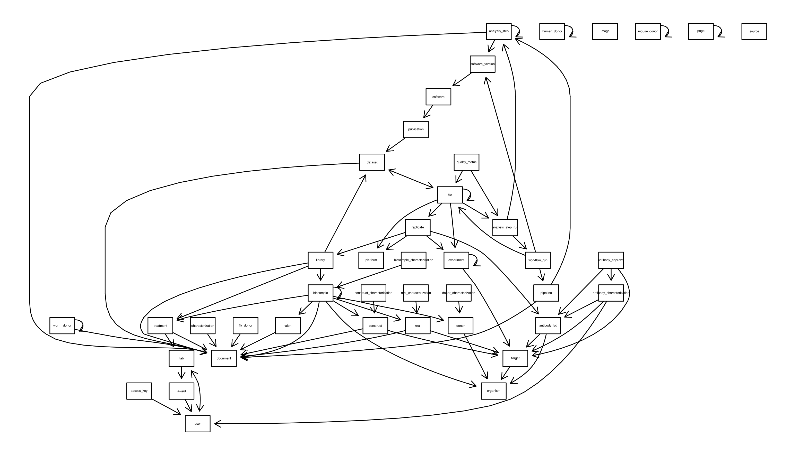

ENCODEdb: xxxxxxxxxxxxxxxxx
====================================================================

Audrey Lemaçon, Charles Joly Beauparlant and Arnaud Droit.

This package and the underlying ENCODEdb code are distributed under 
the Artistic license 2.0. You are free to use and redistribute this software. 

## Introduction

This package xxxxxxxxxxxxxxxxxxxxxxxxxxxxxxxxxxxxxxxxxxxxxxxxxxxxxxxxxxxxx
xxxxxxxxxxxxxxxxxxxxxxxxxxxxxxxxxxxxxxxxxxxxxxxxxxxxxxxxxxxxxxxxxxxxxxxxxx
xxxxxxxxxxxxxxxxxxxxxxxxxxxxxxxxxxxxxxxxxxxxxxxxxxxxxxxxxxxxxxxxxxxxxxxxxx
xxxxxxxxxxxxxxxxxxxxxxxxxxxxxxxxxxxxxxxxxxxxxxxxxxxxxxxxxxxxxxxxxxxxxxxxxx
xxxxxxxxxxxxxxxxxxxxxxxxxxxxxxxxxxxxxxxxxxxxxxxxxxxxxxxxxxxxxxxxxxxxxxxxxx
xxxxxxxxxxxxxxxxxxxxxxxxxxxxxxxxxxxxxxxxxxxxxxxxxxxxxxxxxxxxxxxxxxxxxxxxxx


This vignette will introduce all the main features of the ENCODEdb package.

## Loading metagene package

```{r libraryLoad}
suppressMessages(library(ENCODEdb))
```
 
 
## Data preparation

This package comes with a up-to-date list of dataframe containing the essential 
of ENCODE files metadata: `matrices`. This list contains two elements.
The first one `matrices$experiment` is a data.frame containing essential 
information for each file part of an experiment ; the second one `matrices$dataset`
is a data.frame containing essential information for each file part of a dataset.

This `matrices` is **mandatory** to use the functions provided in this package.

If you want regenerate this list, you have to process the following steps :

* generate the SQL database from ENCODE 

```{r tables}
# the path (relative or absolute) to the future database
database_filename = "encode.sqlite"
#tables = prepare_ENCODEdb(database_filename)
#tables
```

* generate the metadata matrices from the SQL database
```{r matrices}
#matrices <- export_ENCODEdb_matrix(database_filename)
```


The whole process will take several minutes (5 to 15 minutes depending on your
work environment)

### Database model
You can also use the SQL database for own purpose. Here is the imputed database 
model.

#### Schema


The edges indicate relationship between two tables : an origin and a destination. The relation is made between a column of the origin table and the *id* of the destination table.

Those relations are described in the following table :

#### Relations table
|origin| destination|origin column|
|---------|------------|-------------|
|access_key|user|user|
|analysis_step|analysis_step|parents|
|analysis_step|document|documents|
|analysis_step_run|analysis_step|analysis_step|
|analysis_step_run|workflow_run|workflow_run|
|analysis_step|software_version|software_versions|
|antibody_approval|antibody_characterization|characterizations|
|antibody_approval|antibody_lot|antibody|
|antibody_approval|target|target|
|antibody_characterization|antibody_lot|characterizes|
|antibody_characterization|target|target|
|antibody_characterization|user|reviewed_by|
|antibody_lot|organism|host_organism|
|antibody_lot|target|targets|
|award|user|pi|
|biosample|biosample|derived_from|
|biosample|biosample|part_of|
|biosample|biosample|pooled_from|
|biosample_characterization|biosample|characterizes|
|biosample|construct|constructs|
|biosample|document|protocol_documents|
|biosample|donor|donor|
|biosample|organism|organism|
|biosample|rnai|rnais|
|biosample|talen|talens|
|biosample|treatment|treatments|
|characterization|document|documents|
|construct_characterization|construct|characterizes|
|construct|document|documents|
|construct|target|promoter_used|
|construct|target|target|
|dataset|document|documents|
|dataset|file|related_files|
|donor_characterization|donor|characterizes|
|donor|organism|organism|
|experiment|experiment|possible_controls|
|experiment|target|target|
|file|analysis_step_run|step_run|
|file|dataset|dataset|
|file|experiment|dataset|
|file|file|controlled_by|
|file|file|derived_from|
|file|file|paired_with|
|file|file|supercedes|
|file|platform|platform|
|file|replicate|replicate|
|fly_donor|document|documents|
|human_donor|human_donor|children|
|human_donor|human_donor|fraternal_twin|
|human_donor|human_donor|identical_twin|
|human_donor|human_donor|parents|
|human_donor|human_donor|siblings|
|lab|award|awards|
|lab|user|pi|
|library|biosample|biosample|
|library|dataset|spikeins_used|
|library|document|documents|
|library|treatment|treatments|
|mouse_donor|mouse_donor|littermates|
|page|page|parent|
|pipeline|analysis_step|analysis_steps|
|pipeline|analysis_step|end_points|
|pipeline|document|documents|
|publication|dataset|datasets|
|quality_metric|analysis_step_run|step_run|
|quality_metric|file|files|
|replicate|antibody_lot|antibody|
|replicate|experiment|experiment|
|replicate|library|library|
|replicate|platform|platform|
|rnai_characterization|rnai|characterizes|
|rnai|document|documents|
|rnai|target|target|
|software|publication|references|
|software_version|software|software|
|talen|document|documents|
|target|organism|organism|
|treatment|document|protocols|
|treatment|lab|lab|
|user|lab|lab|
|user|lab|submits_for|
|workflow_run|file|input_files|
|workflow_run|pipeline|pipeline|
|workflow_run|software_version|software_version|
|worm_donor|document|documents|
|worm_donor|worm_donor|outcrossed_strain|

For example :
[**file** ---> **replicate** ---> *replicate*] enables to impute the following relation in a SQL query : **file**.*replicate* = **replicate**.*id*.

## Main functions

### Query

The `query` function allow the user to find the subset of files corresponding to
a precise query define following 10 criteria :

|parameter| description|available for|
|---------|------------|-------------|
|accession|*the experiment or dataset accession*|experiment / dataset|
|assay|*the assay type*|experiment|
|biosample|*the biosample name*|experiment|
|dataset_access[^1]|*the dataset accession*|experiment / dataset|
|file_accession|*the file accesion*|experiment / dataset|
|file_format|*the file format*|experiment / dataset|
|lab|*the laboratory*|experiment / dataset|
|organism|*the donor organism*|experiment|
|target|*the experimental target*|experiment|
|treatment|*the treatment*|experiment|


By default, the query use the exact string matching to perform the selection of 
the relevant entries. This behavior can be changed by setting the `fixed` option 
to **FALSE**.

The structure of the result set is similar to the `matrices` structure : a list 
of two elements *experiment* and *dataset*.

For example, to select fastq files produced by RNA-seq assay on human cell MCF-7 :
```{r query_results, collapse=TRUE}
query_results <- query(assay = "RNA-seq", organism = "Homo sapiens", biosample = "MCF-7", file_format = "fastq", fixed = T)
```

The same request with approximate spelling of the assay type and `fixed` option to **TRUE**, will give no results :
```{r query_results_2, collapse=TRUE}
query_results <- query(assay = "rnaseq", organism = "Homo sapiens", biosample = "MCF-7", file_format = "fastq", fixed = T)
```

If you follow the warning guidance and set the `fixed` option to **FALSE** : 
```{r query_results_3, collapse=TRUE}
query_results <- query(assay = "rnaseq", organism = "Homo sapiens", biosample = "MCF-7", file_format = "fastq", fixed = F)
```


These criteria correspond to the filters that you can find on ENCODE portal : 


*Note : the usage of some criteria, like organism or target, will automatically 
dismissed the dataset results because this information isn't available for that type of data.*


### Search
This function simulates a key word search that you could perform through the 
ENCODE web portal.

The `search` function return a data frame which corresponds to the result page 
provided by ENCODE portal.

Here is the example of the following search : *"a549 chip-seq homo sapiens"*.


On ENCODE portal :


With our function :
```{r search_results, collapse=TRUE}
search_results <- search(searchTerm = "a549 chip-seq homo sapiens", limit = "all")
```


### Download

Following a search or a query, you may want to download the corresponding files.
When using, the ENCODE portal you have to select the experiments one after an 
other and for each experiment, select manually the files you're interested in.

Our `download` function is a real time saving feature. To use it, you have to 
provide the results set that you've just get from the `search` or `query` 
function, indicate the origin of the dataset ("search" or "query") and then the 
path to the directory where you want to copy the downloaded files (default "/tmp").

To ensure that the downloading have succeeded, we conduct a check md5 sum 
comparison for each file.

Moreover, if your results set stem from the `search` function, you may want to 
restrict the downloading to a certain type of file. To do so, you can set the 
`format` option ( by default set to "all")

Here is a small query :

```{r query_results_4, collapse=TRUE}
query_results <- query(assay = "switchgear", target ="elavl1", fixed = F)
```

And its equivalent search
```{r search_results_2, collapse=TRUE}
search_results <- search(searchTerm = "switchgear elavl1", limit = "all")
```

To select a particular file format you can :

1/ add this filter to your query and then run the `download` function
```{r query_results_5, collapse=TRUE}
query_results <- query(assay = "switchgear", target ="elavl1", file_format = "bed_broadPeak" , fixed = F)
download(resultSet = query_results, resultOrigin = "query")
```

2/ specify the format to the `download` function
```{r collapse=TRUE}
download(resultSet = search_results, resultOrigin = "search", format = "bed_broadPeak")
```


[^1]:There is a subtle difference between the parameters **accession** and 
**dataset_accession**. In fact, some files can be part of experiment, dataset or 
both.
When using **accession**, you will get all the files directly link to this accession 
(experiment or dataset). While the usage of **dataset_accesstion** will get the 
files directly link to the requested dataset **AND** those which are part of an 
experiment and indirectly link to a dataset (reported as related_files in the 
dataset and related_dataset in experiment)
