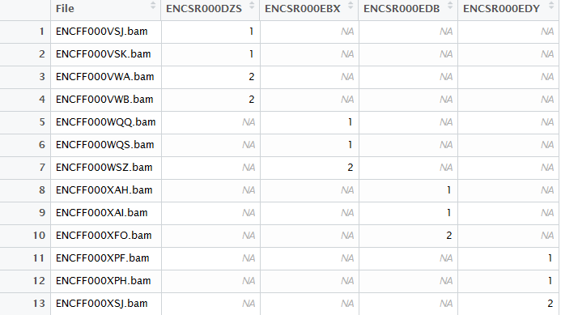
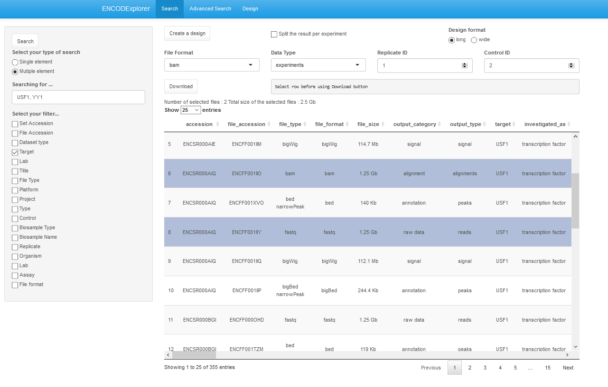

This package and the underlying code are distributed under the Artistic license
2.0. You are free to use and redistribute this software.

# Rationale

"The ENCODE (Encyclopedia of DNA Elements) Consortium is an international
collaboration of research groups funded by the National Human Genome Research
Institute (NHGRI). The goal of ENCODE is to build a comprehensive parts list of
functional elements in the human genome, including elements that act at the
protein and RNA levels, and regulatory elements that control cells and
circumstances in which a gene is active" source:
[ENCODE Projet Portal](https://www.encodeproject.org/).

However, retrieving and downloading data can be time consuming using the
current web portal, especially when multiple files from different experiments
are involved.

This package has been designed to facilitate access to ENCODE data by compiling the
metadata associated with files, experiments, datasets, biosamples, and treatments.

We implemented time-saving features to select ENCODE files by querying their
metadata, downloading them and validating that the file was correctly
downloaded.

This vignette will introduce the main features of the ENCODExplorer package.

# Loading the ENCODExplorer package

```{r libraryLoad, message=FALSE, warning=FALSE}
library(ENCODExplorer)
```

# Introduction

To use the functionalities of the ENCODExplorer package, you must first
download the `data.table` containing all of the ENCODE metadata.

This `data.table` is available through the AnnotationHub package. For
convenience, the latest available version at each release will be downloaded
and used by default.

We also provide the following function to quickly obtain these metadata:

To load `getencode_df` :
```{r load_encodeDF, collapse=TRUE}
encode_df <- get_encode_df()
```

# Main functions

## Query

The `queryEncode` function allows the user to find the subset of files corresponding to
a precise query defined according to the following criteria :

|Parameter| Description|
|---------|-------------|
|set_accession|The accession for the containing experiment or dataset|
|dataset_accession|There is a subtle difference between the parameters **set_accession** and **dataset_accession**. In fact, some files can be part of an experiment, a dataset or both. When using **set_accession**, you will get all the files directly associated with this accession (experiment and/or dataset). While the usage of **dataset_accession** will get the files directly associated to the requested dataset **AND** those which are part of an experiment and indirectly linked to a dataset (reported as related files in the dataset and related_dataset in the experiment).|
|file_accession|The accesion for one specific file|
|biosample_name|The biosample name ("GM12878", "kidney")|
|biosample_type|The biosample type ("tissue", "cell line")|
|assay|The assay type ("ChIP-seq", "polyA RNA-seq")|
|file_format|The file format. Some currently available formats include *bam*, *bed*, *fastq*, *bigBed*, *bigWig*, *CEL*, *csfasta*, *csqual*, *fasta*, *gff*, *gtf*, *idat*, *rcc*, *sam*, *tagAlign*, *tar*, *tsv*, *vcf*, *wig*.|
|lab|The laboratory|
|organism|The donor organism ("Homo sapiens", "Mus musculus")|
|target|The gene, protein or histone mark which was targeted by the assay (Immunoprecipitated protein in ChIP-seq, knocked-down gene in CRISPR RNA-seq assays, etc)|
|treatment|The treatment related to the biosample|
|project|The project name/id|


By default, the query function uses exact string matching to perform the
selection of the relevant entries. This behavior can be changed by modifying the
`fixed` or `fuzzy` parameters. Setting `fixed` to `FALSE` will perform
case-insensitive regular expression matching. Setting `fuzzy` to `TRUE` will
retrieve search results where the query string is a partial match.

The result set is a subset of the `encode_df_lite` table.

For example, to select all fastq files originating from assays on the MCF-7
(human breast cancer) cell line:

```{r query_results, collapse=TRUE, eval =T}
query_results <- queryEncode(organism = "Homo sapiens", 
                      biosample_name = "MCF-7", file_format = "fastq",
                      fixed = TRUE)
```

The same request with approximate spelling of the biosample name will return 
no results:

```{r query_results_2, collapse=TRUE}
query_results <- queryEncode(organism = "Homo sapiens", biosample_name = "mcf7",
                        file_format = "fastq", fixed = TRUE,
                        fuzzy = FALSE)
```

However, if you follow the warning guidance and set the `fuzzy` parameter to 
`TRUE`:

```{r query_results_3, collapse=TRUE}
query_results <- queryEncode(organism = "Homo sapiens",
                    biosample_name = "mcf7", file_format = "fastq",
                    fixed = TRUE, fuzzy = TRUE)
```

You can also perform matching through regular expressions by setting fixed to 
`FALSE`.

```{r query_results_4, collapse=TRUE}
query_results <- queryEncode(assay = ".*RNA-seq",
                    biosample_name = "HeLa-S3", fixed = FALSE)
table(query_results$assay)
```

Finally, the `queryEncodeGeneric` function can be used to perform searches on
columns which are not part of the queryEncode interface but are present within
the encode_df_lite data.table:

```{r query_results_5, collapse=TRUE}
query_results <- queryEncodeGeneric(biosample_name="HeLa-S3",
				    assay="RNA-seq", submitted_by="Diane Trout",
				    fuzzy=TRUE)
table(query_results$submitted_by)
```

These criteria correspond to the filters that you can find on ENCODE portal:


## fuzzySearch

This function is a more user-friendly version of `queryEncode` that also
perform searches on the `encode_df_lite` object. The character vector or the 
list of characters specified by the user will be searched for in every column of
the database. The user can also constrain the query by selecting the specific 
columns in which to search for the query term by using the `filterVector` 
parameter.

The following request will produce a data.table with every files containing
the term *brca*.

```{r fuzzy_results, collapse=TRUE}
fuzzy_results <- fuzzySearch(searchTerm = c("brca"))
```

Multiple terms can be searched simultaneously. This example extracts all
files containing brca or ZNF24 within the *target* column.

```{r fuzzy_results_2, collapse=TRUE}
fuzzy_results <- fuzzySearch(searchTerm = c("brca", "ZNF24"),
                             filterVector = c("target"),
                             multipleTerm = TRUE)
```

When searching for multiple terms, three type of input can be passed to the
`searchTerm` parameter :
- A single character where the various terms are separated by commas
- A character vector
- A list of characters

## Search

This function simulates a keyword search performed through the
ENCODE web portal.

The `searchEncode` function returns a `data frame` corresponding to the result
page provided by the ENCODE portal. If a specific file or dataset isn't
available with `fuzzySearch` or `queryEncode` (i.e. within `get_encode_df()`),
the user can access the latest data from the ENCODE database through the
searchEncode function.

The `searchToquery` function convert the result of a search to a `data.table` 
with the same design as `get_encode_df()`. This format contains more metadata
and allow the user to extract all files within the dataset. This format also
allows the user to create a design using the `createDesign` function.

Here is the example of the following search : *"a549 chip-seq homo sapiens"*.

On ENCODE portal :


With our function :
```{r search_results, collapse=TRUE}
  search_results <- searchEncode(searchTerm = "a549 chip-seq homo sapiens",
                                 limit = "all")
```

## createDesign

This function organizes the `data.table` created by `fuzzySearch`, `queryEncode`
or `searchToquery`. It extracts the replicate and control files within a dataset.

It creates a `data.table` with the file accessions, the dataset accessions and
numeric values associated with the nature of the file (1:replicate / 2:control)
when the `format` parameter is set to `long`.

By setting the `format` parameter to `wide`, each dataset will have its own column
as illustrated below.



## downloadEncode

`downloadEncode` allows a user to download a file or an entire dataset. Downloading
files can be done by providing a vector of file accessions or dataset accessions
(represented by the accession column in `get_encode_df()`) to the `file_acc` parameter.
This parameter can also be the `data.table` created by `queryEncode`, `fuzzySearch`,
`searchToquery` or `createDesign`.

If the accession doesn't exist within the passed-in `get_encode_df()` database,
`downloadEncode` will search for the accession directly within the ENCODE database.
The path to the download directory can be specified (default: `/tmp`).

To ensure the integrity of each file, the md5 sum of each downloaded file
is compared to the reported md5 sum in ENCODE.

Moreover, if the accession is a dataset accession, the function will download each
file in this dataset. The format option, which is set by default to all, enables the
downloading of a specific format.

Here is a small example query:

```{r query_results_6, collapse=TRUE}
query_results <- queryEncode(assay = "switchgear", target ="elavl1", fixed = FALSE)
```

And its equivalent search:

```{r search_results_1, collapse=TRUE}
search_results <- searchEncode(searchTerm = "switchgear elavl1", limit = "all")
```

To select a particular file format you can:

1)  add filters to your query and then run the `downloadEncode` function.

```{r query_results_7, collapse=TRUE, eval=FALSE}
query_results <- queryEncode(assay = "switchgear", target ="elavl1",
                             file_format = "bed" , fixed = FALSE)
downloadEncode(query_results)
```

2) specify the format to the `downloadEncode` function.

```{r collapse=TRUE, eval=FALSE}
downloadEncode(search_results, format = "bed")
```

## Conversion

The function `searchToquery` enables the conversion of the results of
`searchEncode` to a `queryEncode` output based on the accession numbers.
The user can then benefit from all the collected metadata and the `createDesign`
function.

The structure of the result set is similar to the `get_encode_df()` structure.

Let's try it with the previous example :

1) search

```{r search_results_2, collapse=TRUE}
search_results <- searchEncode(searchTerm = "switchgear elavl1", limit = "all")
```

2) convert
```{r convert_results_1, collapse=TRUE}
convert_results <- searchToquery(searchResults = search_results)
```

## shinyEncode

This function launches the shinyApp of ENCODExplorer that implements the
`fuzzySearch` and `queryEncode` search functions. It also allows the creation
of a design to organize and download specific files with the `downloadEncode`
function. The Search tab of shinyEncode uses the `fuzzySearch` function for a
low specificity request while the `Advanced Search` tab uses the `queryEncode`
function.



# Summarizing ENCODE data

While queryEncode, searchEncode and downloadEncode gives the user access to
ENCODE's raw files, ENCODExplorer also provides helper functions which load and 
summarize ENCODE data for common biological questions.

## Obtaining consensus peaks from ChIP-Seq

The most common question in a ChIP-Seq assay is: "Where does the protein of
interest bind the genome?" To answer this question, ENCODExplorer provides the
`queryConsensusPeaks` method. `queryConsensusPeaks` finds all ChIP-seq peak
files matching the given criteria, split them by treatment group, and determines
which peaks appear in all replicates:

```{r query_consensus_peaks_call, collapse=TRUE}
# Obtain a summary of all peaks for NR3C1 ChIP-Seq assays in the A549
# cell line.
res = queryConsensusPeaks("A549", "GRCh38", "NR3C1")

# The list of downloaded files is available through the files() method.
files(res)

# The metadata for those file is available through the file_metadata() method.
# The file metadata are split according to treatment group:
file_metadata(res)

# A data-frame explaining how each treatment group was split is available
# through the metadata() method:
metadata(res)

# The list of all peaks identified in individual files are accessed through 
# the peaks() method.
peaks(res)

# Finally, the consensus peaks (those who are present in all individual
# replicates) are accessed through the consensus() method:
consensus(peaks)
```

## Fine-tuning a consensus peaks query

Certain versions of the ENCODE pipeline provide multiple calling algorithms.
Also, sometimes multiple labs have performed ChIP-seq experiments on the same
tissue and protein, and these results might not be directly comparable.
ENCODExplorer uses heuristics to try and determine which set of files will
provide the most informative results, but the results of these heuristics might 
prove unsatisfactory. 

In such cases, a user can provide his own set of ENCODE metadata and his own 
choice of splitting columns using the `buildQueryConsensus` function. The user
can also specify which proportion of individual replicates a peak must appear in
to be included in the consensus peaks:

```{r build_consensus_peaks_call, collapse=TRUE}
query_results = queryEncodeGeneric(biosample_name="A549", assembly="GRCh38",
                                   file_format="bed", output_type="peaks", 
                                   target="NR3C1", treatment_duration_unit="minute")

# Obtain a summary of all peaks for NR3C1 ChIP-Seq assays in the A549
# cell line.
res = buildConsensusPeaks(query_results, split_by=c("treatment_duration"), 
                          consensus_threshold=0.5)

res
```

## Obtaining average gene expression

For RNA-Seq experiment, the most straightforward type of results is the 
expression level of all genes or transcripts. ENCODExplorer provides the 
`queryGeneExpression` and `queryTranscriptExpression` methods to summarize
these results.

```{r query_gene_expression, collapse=TRUE}
# Obtain a summary of all peaks for NR3C1 ChIP-Seq assays in the A549
# cell line.
res = queryGeneExpression("A549", "GRCh38", "NR3C1")

# The list of downloaded files is available through the files() method.
files(res)

# The metadata for those file is available through the file_metadata() method.
# The file metadata are split according to treatment group:
file_metadata(res)

# A data-frame explaining how each treatment group was split is available
# through the metadata() method:
metadata(res)

# The list of all peaks identified in individual files are accessed through 
# the peaks() method.
peaks(res)

# Finally, the consensus peaks (those who are present in all individual
# replicates) are accessed through the consensus() method:
consensus(peaks)
```
# Updating the ENCODE file database

By default, ENCODExplorer retrieves the ENCODE metadata from its sister
package, `r Biocpkg("ENCODExplorerData")`. The version of the metadata provided
by default will be updated with each Bioconductor release in the
`ENCODExplorer` package. However, since all of ENCODExplorer's function take an
explicit `df` parameter, it is possible to use the `r Biocpkg("AnnotationHub")`
package to download a more recent version:

```{r ah, message=FALSE}
require(AnnotationHub)
ah = AnnotationHub()
query(ah, "ENCODExplorerData")
```

Finally, it is also possible to use `r Biocpkg("ENCODExplorerData")`
functionalities to generate an up-to-date `data.table`, and pass it to
`ENCODExplorer`'s functions.

We refer the user to the `r Biocpkg("ENCODExplorerData")` vignettes for details
on how to generate an up-to-date `data.table`.
