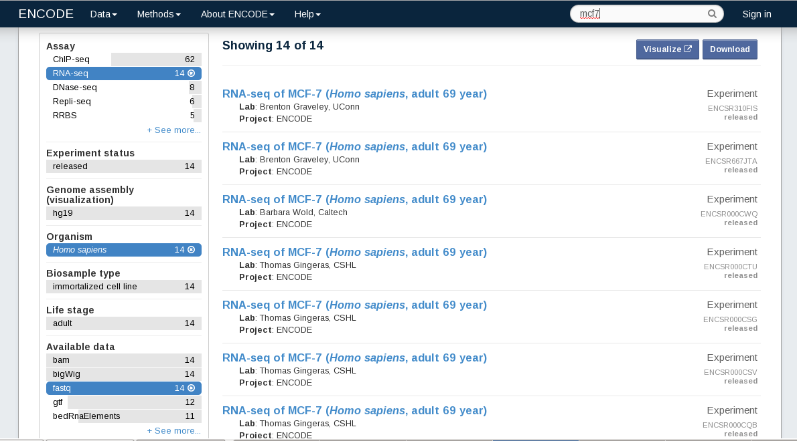
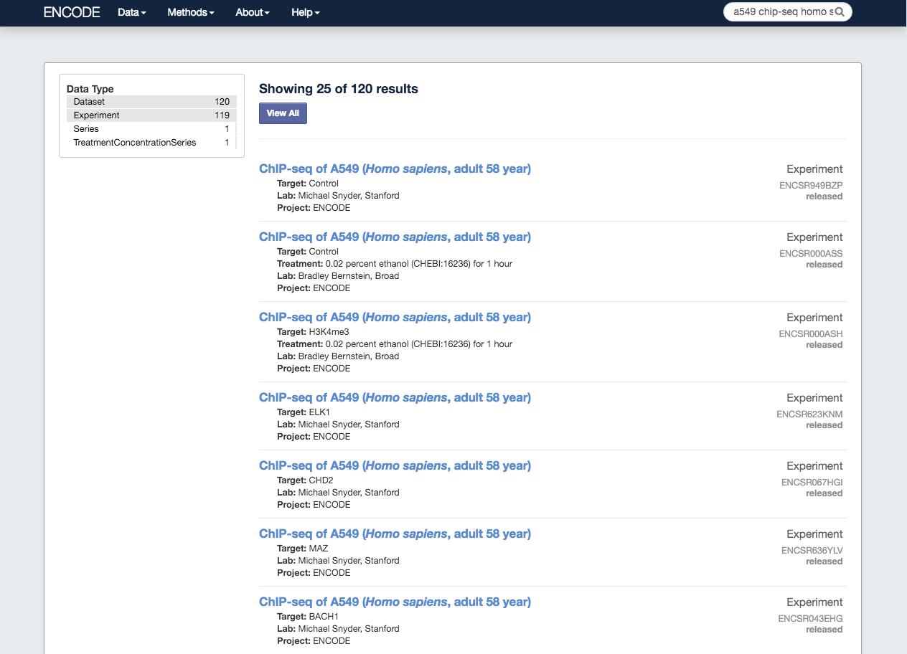

<!--
%\VignetteEngine{knitr::knitr}
%\VignetteIndexEntry{Introduction to ENCODExplorer}
-->

ENCODExplorer: A compilation of metadata from ENCODE
====================================================================

Audrey Lemacon, Charles Joly Beauparlant and Arnaud Droit.

This package and the underlying ENCODExplorer code are distributed under 
the Artistic license 2.0. You are free to use and redistribute this software. 

"The ENCODE (Encyclopedia of DNA Elements) Consortium is an international 
collaboration of research groups funded by the National Human Genome Research 
Institute (NHGRI). The goal of ENCODE is to build a comprehensive parts list of 
functional elements in the human genome, including elements that act at the 
protein and RNA levels, and regulatory elements that control cells and 
circumstances in which a gene is active"^[source: [ENCODE Projet Portal ](https://www.encodeproject.org/)] .

However, data retrieval and downloading can be really time consuming using 
current web portal, especially with multiple files from different experiments.

This package has been designed to facilitate the data access by compiling the 
metadata associated with file, experiment, dataset, biosample, and treatment. 

We first extract ENCODE schema from its public github repository to rebuild 
the ENCODE database into an SQLite database. Thanks to this package, the user 
will be enable to generate, store and query ENCODE database locally. We also 
developped a function which can extract the essential metadata in a R object to 
aid data exploration.

We implemented time-saving features to select ENCODE files by querying their 
metadata, downloading them and validating that the file was correctly
downloaded.

The SQLite database can be regenerated at will to keep it up-to-date.

This vignette will introduce all the main features of the ENCODExplorer package.

### Loading ENCODExplorer package

```{r libraryLoad, warning=FALSE}
suppressMessages(library(ENCODExplorer))
```

### Introduction

Up to date, there are 7 types of dataset in ENCODE : annotation, experiment, 
matched-set, project, reference, reference-epigenome and ucsc-browser-composite.
This package comes with a up-to-date list of `data.frame` containing the essential
of ENCODE files metadata: `encode_df`. This list contains two elements.
The first one `encode_df$experiment` is a `data.frame` containing information for
each file part of an experiment dataset ; the second one `encode_df$dataset` is a
`data.frame` containing information for each file part of a non-experiment dataset. 

The `encode_df` object is **mandatory** for the functions provided in this package.

In the current release, `encode_df` contains 86083 entries for experiments and 
4747 entries for non-experiment datasets.

### Main functions

#### Query

The `queryEncode` function allow the user to find the subset of files corresponding to
a precise query defined according to the following criteria :

|parameter|available for| description|
|---------|------------|-------------|
|set_accession|experiment / dataset|The experiment or dataset accession|
|assay|experiment|The assay type|
|biosample|experiment|The biosample name|
|dataset_access^[There is a subtle difference between the parameters **set_accession** and
**dataset_accession**. In fact, some files can be part of experiment, dataset or
both. When using **set_accession**, you will get all the files directly linked with
this accession (experiment and/or dataset). While the usage of
**dataset_accesstion** will get the files directly link to the requested
dataset **AND** those which are part of an experiment and indirectly link to a
dataset (reported as related_files in the dataset and related_dataset in
experiment).] |experiment / dataset|The dataset accession|
|file_accession|experiment / dataset|The file accesion|
|file_format^[The current version of encode_df contains the following file format : 
*fastq*,*bed*,*bigBed*,*bam*,*tsv*,*bigWig*,*rcc*,*csfasta*,*idat*,*gtf*,*tar*,
*CEL*,*csqual*,*sam*,*wig*,*gff*,*fasta*,*tagAlign*]|experiment / dataset|The file format|
|lab|experiment / dataset|The laboratory|
|organism|experiment|The donor organism|
|target|experiment|The experimental target|
|treatment|experiment|The treatment|
|project|experiment / dataset|The Project|


By default, the query use the exact string matching to perform the selection of 
the relevant entries. This behavior can be changed by setting the `fixed` option 
to **FALSE**.

The structure of the result set is similar to the `encode_df` structure : a list 
of two elements *experiment* and *dataset*.

For example, to select all the fastq files produced on human
cell MCF-7:
# ```{r query_results, collapse=TRUE}
# query_results <- queryEncode(organism = "Homo sapiens",
#                        biosample_name = "MCF-7", file_format = "fastq", fixed = TRUE)
# ```

The same request with approximate spelling of the assay type and `fixed` option
to `TRUE`, will give no results :
# ```{r query_results_2, collapse=TRUE}
# query_results <- queryEncode(organism = "Homo sapiens",
#                        biosample_name = "mcf7", file_format = "fastq", fixed = TRUE)
# ```

If you follow the warning guidance and set the `fixed` option to `FALSE``:
#```{r query_results_3, collapse=TRUE}
# query_results <- queryEncode(organism = "Homo sapiens",
#                       biosample_name = "mcf7", file_format = "fastq",
#                       fixed = FALSE)
```

These criteria correspond to the filters that you can find on ENCODE portal : 



*Note: the usage of some criteria, like organism or target, will automatically
dismiss the dataset results because this information isn't available for that
type of data.*


#### Search
This function simulates a key word search that you could perform through the
ENCODE web portal.

The `searchEncode` function returns a data frame which corresponds to the result page
provided by ENCODE portal.

Here is the example of the following search : *"a549 chip-seq homo sapiens"*.

On ENCODE portal :



With our function :
```{r search_results, collapse=TRUE}
search_results <- searchEncode(searchTerm = "a549 chip-seq homo sapiens",
                         limit = "all")
```

#### Download

Following a search or a query, you may want to download the corresponding files.

Our `downloadEncode` function is a real time saving feature. To use it, you have to 
provide the results set that you've just get from the `searchEncode` or `queryEncode` 
function, indicate the origin of the dataset ("searchEncode" or "queryEncode") and then the 
path to the directory where you want to copy the downloaded files
(default: `/tmp`).

To ensure that the downloading have succeeded, we conduct a check md5 sum 
comparison for each file.

Moreover, if your results set stem from the `searchEncode` function, you may want to 
restrict the downloading to a certain type of file. To do so, you can set the 
`format` option (which is set by defaul to `all`)

Here is a small query:

#```{r query_results_4, collapse=TRUE}
#query_results <- queryEncode(assay = "switchgear", target ="elavl1", fixed = FALSE)
#```

And its equivalent search:

```{r search_results_2, collapse=TRUE}
search_results <- searchEncode(searchTerm = "switchgear elavl1", limit = "all")
```

To select a particular file format you can:

1) add this filter to your query and then run the `downloadEncode` function

```{r query_results_5, collapse=TRUE, eval=TRUE}
query_results <- queryEncode(assay = "switchgear", target ="elavl1",
                       file_format = "bed" , fixed = FALSE)
downloadEncode(resultSet = query_results, resultOrigin = "queryEncode")
```

2) specify the format to the `downloadEncode` function

```{r collapse=TRUE, eval=TRUE}
#downloadEncode(resultSet = search_results, resultOrigin = "searchEncode", format = "bed")
```


#### Conversion
The function `searchToquery` enables to convert a `searchEncode` output in a `queryEncode` output based on the found accession numbers. Thus the user can benefit from all the collected metadata.

The structure of the result set is similar to the `encode_df` structure : a list 
of two dataframe *experiment* and *dataset*.

Let's try it with the previous example :

1) search 

```{r search_results_3, collapse=TRUE}
search_results <- searchEncode(searchTerm = "switchgear elavl1", limit = "all")
```

2) convert
```{r conert_results_1, collapse=TRUE}
convert_results <- searchToquery(searchResults = search_results)
```

